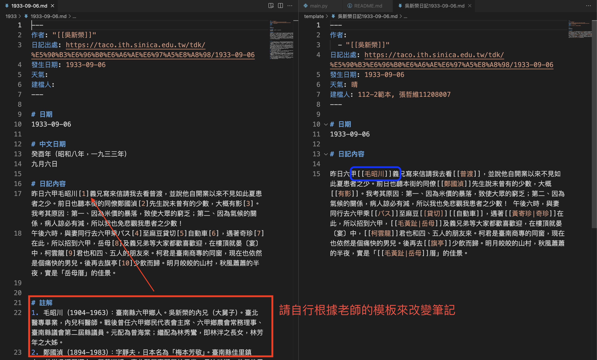

# 台灣日記知識庫爬蟲

NCKU 2024 Fall - 史學研究的數位工具

資料來源: 
- [台灣日記知識庫](https://taco.ith.sinica.edu.tw/tdk/)
- [吳新榮日記](https://taco.ith.sinica.edu.tw/tdk/%E5%90%B3%E6%96%B0%E6%A6%AE%E6%97%A5%E8%A8%98)

## Installation
```
pip install -r requirements.txt
```

1. check your Chrome version and download the corresponding chromedriver from [here](https://developer.chrome.com/docs/chromedriver/downloads?hl=zh-tw)
2. put the chromedriver in the same directory as the script
3. change the `url_to_crawl` in the `main.py` to the url you want to crawl
4. run the script
```
python main.py
```

## Result
The scraper will generate markdown file in `year` folder (filename in `yyyy-mm-dd.md` format)

The collected data are not the formal format of your assignment, you may need to do some post-processing to reach teacher's requirement.

